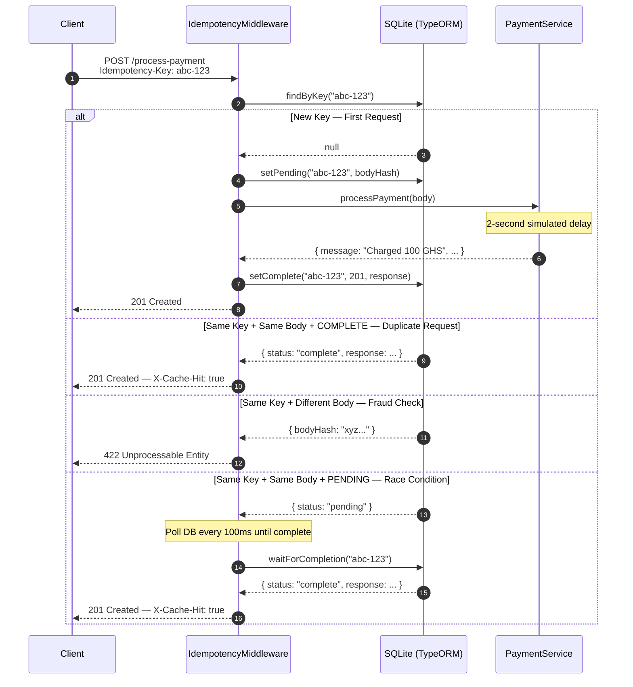

# Idempotency Gateway — The "Pay-Once" Protocol

> A payment processing API that guarantees every transaction is executed **exactly once**, no matter how many times the request is retried.

Built with **NestJS** + **TypeScript** + **SQLite** (via TypeORM).  
No database setup required — clone, install, and run.

---

## The Problem This Solves

FinSafe's e-commerce clients occasionally experience network timeouts. When this happens, their servers automatically retry payment requests — causing customers to be **charged twice**.

This API solves that by assigning every payment request a unique `Idempotency-Key`. No matter how many times the same request is retried, the payment is processed **exactly once**.

---

## Architecture Diagram



---

## Setup Instructions

### Prerequisites
- Node.js v18 or higher
- npm v9 or higher

No database installation required — SQLite is bundled automatically.

### Installation & Running

```bash
# 1. Clone the repository
git clone https://github.com/<your-username>/Idempotency-Gateway.git
cd Idempotency-Gateway

# 2. Install dependencies
npm install

# 3. Start the server
npm start
```

Server runs on **http://localhost:3000**

A `database.sqlite` file is created automatically in the project root on first run.

For development with hot reload:
```bash
npm run start:dev
```

---

## Project Structure

```
src/
├── main.ts                           ← Entry point
├── app.module.ts                     ← Root module, registers middleware
├── middleware/
│   └── idempotency.middleware.ts     ← Core idempotency logic
├── store/
│   ├── idempotency-record.entity.ts  ← SQLite table definition
│   ├── idempotency-status.enum.ts    ← PENDING | COMPLETE enum
│   ├── idempotency.store.ts          ← Database operations
│   └── store.module.ts               ← Store module
└── payment/
    ├── payment.controller.ts         ← POST /process-payment
    ├── payment.service.ts            ← Payment business logic
    ├── payment.dto.ts                ← Request/response shape
    └── payment.module.ts             ← Payment module
```

---

## API Documentation

### `POST /process-payment`

Processes a payment exactly once for a given idempotency key.

#### Request Headers

| Header | Required | Description |
|--------|----------|-------------|
| `Content-Type` | ✅ | `application/json` |
| `Idempotency-Key` | ✅ | Unique string per transaction (UUID recommended) |

#### Request Body

```json
{
  "amount": 100,
  "currency": "GHS"
}
```

---

### Response Scenarios

#### ✅ 201 — First Request (New Transaction)

```bash
curl -X POST http://localhost:3000/process-payment \
  -H "Content-Type: application/json" \
  -H "Idempotency-Key: a1b2c3d4-e5f6-7890-abcd-ef1234567890" \
  -d '{"amount": 100, "currency": "GHS"}'
```

```json
{
  "message": "Charged 100 GHS",
  "transactionId": "f47ac10b-58cc-4372-a567-0e02b2c3d479",
  "amount": 100,
  "currency": "GHS",
  "processedAt": "2026-06-05T17:00:00.000Z"
}
```

---

#### ♻️ 201 — Duplicate Request (Instant Replay)

Same key, same body — returns immediately with no 2-second delay.

Response headers include `X-Cache-Hit: true`.

```json
{
  "message": "Charged 100 GHS",
  "transactionId": "f47ac10b-58cc-4372-a567-0e02b2c3d479",
  "amount": 100,
  "currency": "GHS",
  "processedAt": "2026-06-05T17:00:00.000Z"
}
```

Note: `transactionId` and `processedAt` are identical to the first response — this confirms the payment was not processed again.

---

#### ❌ 422 — Same Key, Different Body (Fraud/Error Check)

```bash
curl -X POST http://localhost:3000/process-payment \
  -H "Content-Type: application/json" \
  -H "Idempotency-Key: a1b2c3d4-e5f6-7890-abcd-ef1234567890" \
  -d '{"amount": 500, "currency": "GHS"}'
```

```json
{
  "statusCode": 422,
  "message": "Idempotency key already used for a different request body."
}
```

---

#### ❌ 422 — Missing Idempotency-Key Header

```bash
curl -X POST http://localhost:3000/process-payment \
  -H "Content-Type: application/json" \
  -d '{"amount": 100, "currency": "GHS"}'
```

```json
{
  "statusCode": 422,
  "message": "Missing required header: Idempotency-Key"
}
```

---

## Design Decisions

### 1. NestJS Middleware for Idempotency Logic
The idempotency check lives entirely in `IdempotencyMiddleware`. The `PaymentController` and `PaymentService` have zero awareness of idempotency — they just process payments. This separation means payment logic stays clean and independently testable, while the middleware handles the protocol layer.

### 2. SQLite for Zero-Config Setup
SQLite requires no installation or configuration. Anyone who clones this repo can run `npm install && npm start` and the server starts immediately — the database file is created automatically. The `IdempotencyStore` is fully abstracted behind a NestJS injectable service, so swapping to PostgreSQL or Redis in production requires changing only the TypeORM config in `app.module.ts`.

### 3. SHA-256 Body Hashing for Payload Comparison
Rather than storing the full request body, a SHA-256 fingerprint is stored. This is constant in memory size regardless of payload size and collision-resistant enough for this use case. If the same key arrives with a different body, the hashes won't match and the request is rejected immediately.

### 4. PENDING State for Race Condition Handling
When a new key arrives, it is marked `PENDING` in the database before processing begins. If a duplicate arrives during the 2-second processing window, the middleware detects `PENDING` and polls every 100ms until the original completes, then replays the result. This prevents both double-processing and incorrect error responses under concurrency.

### 5. Response Interception via `res.json` Override
To capture the outgoing response for caching without modifying the controller, the middleware overrides `res.json()` before calling `next()`. The controller sends its response normally, unaware that the middleware is transparently capturing and persisting it to the database.

---

## Developer's Choice: 24-Hour TTL Key Expiry

### What it is
Every idempotency key expires **24 hours** after creation. After that window the key is treated as non-existent, and a new request with the same key is processed as a fresh transaction.

### Why it matters for Fintech
Without expiry, the `idempotency_records` table grows unboundedly — a storage leak in production. More importantly, it mirrors the real-world standard used by Stripe, Paystack, and most payment APIs. A 24-hour window gives clients a safe and predictable retry period while ensuring stale data does not persist indefinitely.

### Implementation
Every record stores an `expiresAt` timestamp (24 hours from creation). The `findByKey()` method checks this on every read — expired records are deleted immediately and the calling code receives `null`, treating the request as brand new.

---

## Pre-Submission Checklist

- [x] Repository is public on GitHub
- [x] `node_modules`, `.env`, and `database.sqlite` are in `.gitignore`
- [x] `npm install && npm start` works immediately after cloning
- [x] Architecture diagram included above
- [x] Original README instructions replaced with this documentation
- [x] API endpoints and example requests documented
- [x] Multiple meaningful commits in git history