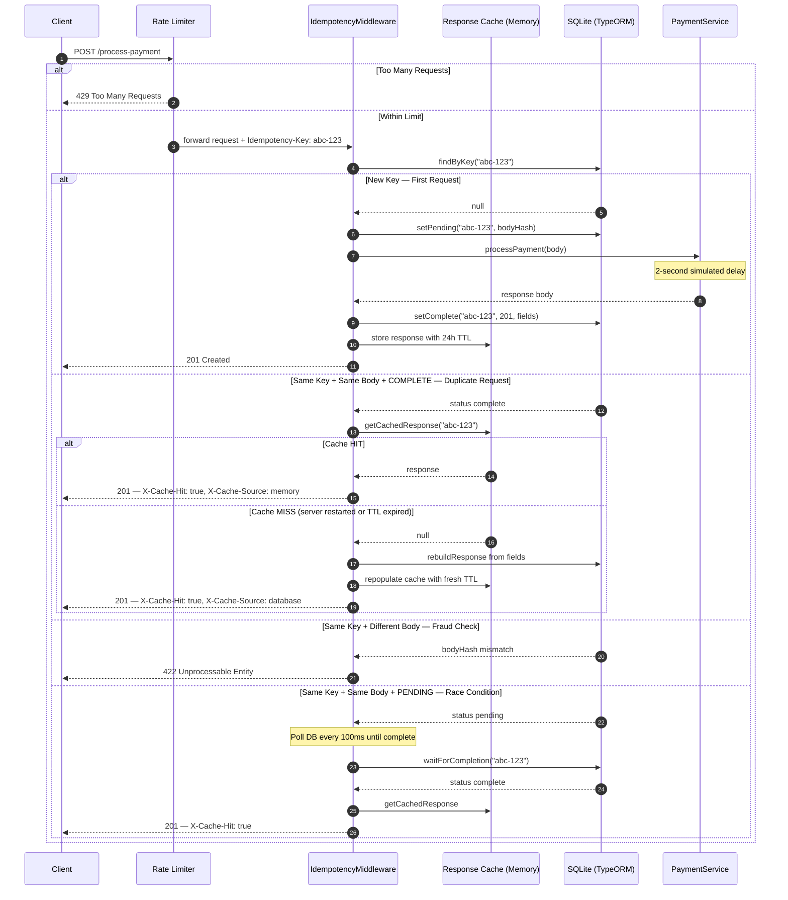

# Idempotency Gateway — The "Pay-Once" Protocol

> A payment processing API that guarantees every transaction is executed **exactly once**, no matter how many times the request is retried.

Built with **NestJS** + **TypeScript** + **SQLite** (via TypeORM).  
No database setup required — clone, install, and run.

---

## The Problem This Solves

FinSafe's e-commerce clients occasionally experience network timeouts. When this happens, their servers automatically retry payment requests — causing customers to be **charged twice**.

This API solves that by assigning every payment request a unique `Idempotency-Key`. No matter how many times the same request is retried, the payment is processed **exactly once**.

---

## Architecture Diagram



---

## Setup Instructions

### Prerequisites
- Node.js v18 or higher
- npm v9 or higher

No database installation required — SQLite is bundled automatically.

### Installation & Running

```bash
# 1. Clone the repository
git clone https://github.com/PBentil/Idempotency-Gateway
cd Idempotency-Gateway

# 2. Install dependencies
npm install

# 3. Start the server
npm start
```

Server runs on **http://localhost:3000**

A `database.sqlite3` file is created automatically in the project root on first run.

For development with hot reload:
```bash
npm run start:dev
```

---

## Project Structure

```
src/
├── main.ts                           ← Entry point, registers validation pipe
├── app.module.ts                     ← Root module, registers middleware + rate limiter
├── middleware/
│   └── idempotency.middleware.ts     ← Core idempotency logic
├── store/
│   ├── idempotency-record.entity.ts  ← SQLite table definition
│   ├── idempotency-status.enum.ts    ← PENDING | COMPLETE enum
│   ├── idempotency.store.ts          ← Database + cache operations
│   └── store.module.ts               ← Store module
└── payment/
    ├── payment.controller.ts         ← POST /process-payment
    ├── payment.service.ts            ← Payment business logic
    ├── payment.dto.ts                ← Request validation rules
    └── payment.module.ts             ← Payment module
```

---

## API Documentation

### `POST /process-payment`

Processes a payment exactly once for a given idempotency key.

#### Request Headers

| Header | Required | Description |
|--------|----------|-------------|
| `Content-Type` | ✅ | `application/json` |
| `Idempotency-Key` | ✅ | Unique string per transaction (UUID recommended) |

#### Request Body

| Field | Type | Rules |
|-------|------|-------|
| `amount` | number | Positive, max 2 decimal places, max 1,000,000 |
| `currency` | string | One of: `GHS`, `USD`, `EUR`, `GBP`, `NGN` |

```json
{
  "amount": 100,
  "currency": "GHS"
}
```

#### Response Headers

| Header | Description |
|--------|-------------|
| `X-Cache-Hit` | `true` when response is a replay |
| `X-Cache-Source` | `memory` (in-memory cache) or `database` (rebuilt from DB) |

---

### Response Scenarios

#### ✅ 201 — First Request (New Transaction)

```bash
curl -X POST http://localhost:3000/process-payment \
  -H "Content-Type: application/json" \
  -H "Idempotency-Key: a1b2c3d4-e5f6-7890-abcd-ef1234567890" \
  -d '{"amount": 100, "currency": "GHS"}'
```

```json
{
  "message": "Charged 100 GHS",
  "transactionId": "f47ac10b-58cc-4372-a567-0e02b2c3d479",
  "amount": 100,
  "currency": "GHS",
  "processedAt": "2026-06-07T17:00:00.000Z"
}
```

---

#### ♻️ 201 — Duplicate Request (Instant Replay from Cache)

Same key, same body — returns immediately with no 2-second delay.

```
X-Cache-Hit: true
X-Cache-Source: memory
```

```json
{
  "message": "Charged 100 GHS",
  "transactionId": "f47ac10b-58cc-4372-a567-0e02b2c3d479",
  "amount": 100,
  "currency": "GHS",
  "processedAt": "2026-06-07T17:00:00.000Z"
}
```

`transactionId` and `processedAt` are identical to the first response — confirming the payment was not processed again.

---

#### ♻️ 201 — Duplicate After Server Restart (Rebuilt from DB)

Cache is cold after restart — response is rebuilt from stored fields and cache is repopulated.

```
X-Cache-Hit: true
X-Cache-Source: database
```

---

#### ❌ 429 — Rate Limit Exceeded

```json
{
  "statusCode": 429,
  "message": "ThrottlerException: Too Many Requests"
}
```

---

#### ❌ 422 — Same Key, Different Body (Fraud/Error Check)

```bash
curl -X POST http://localhost:3000/process-payment \
  -H "Content-Type: application/json" \
  -H "Idempotency-Key: a1b2c3d4-e5f6-7890-abcd-ef1234567890" \
  -d '{"amount": 500, "currency": "GHS"}'
```

```json
{
  "statusCode": 422,
  "message": "Idempotency key already used for a different request body."
}
```

---

#### ❌ 422 — Missing Idempotency-Key Header

```json
{
  "statusCode": 422,
  "message": "Missing required header: Idempotency-Key"
}
```

---

#### ❌ 400 — Invalid Request Body

```json
{
  "message": ["Amount must be a number"],
  "error": "Bad Request",
  "statusCode": 400
}
```

Common validation errors:
- `Amount must be a number`
- `Amount must be a positive number`
- `Amount cannot have more than 2 decimal places`
- `Amount cannot exceed 1,000,000`
- `Currency must be one of: GHS, USD, EUR, GBP, NGN`

---

#### ❌ 503 — In-Flight Request Timed Out

```json
{
  "statusCode": 503,
  "message": "Original request is still processing. Please retry shortly."
}
```

---

## Design Decisions

### 1. NestJS Middleware for Idempotency Logic
The idempotency check lives entirely in `IdempotencyMiddleware`. The `PaymentController` and `PaymentService` have zero awareness of idempotency — they just process payments. This separation means payment logic stays clean and independently testable, while the middleware handles the protocol layer.

### 2. SQLite for Zero-Config Setup
SQLite requires no installation or configuration. Anyone who clones this repo can run `npm install && npm start` and the server starts immediately — the database file is created automatically. The `IdempotencyStore` is fully abstracted behind a NestJS injectable service, so swapping to PostgreSQL or Redis in production requires changing only the TypeORM config in `app.module.ts`.

### 3. SHA-256 Body Hashing for Payload Comparison
Rather than storing the full request body, a SHA-256 fingerprint is stored. This is constant in size regardless of payload size and collision-resistant enough for this use case. If the same key arrives with a different body, the hashes won't match and the request is rejected immediately.

### 4. PENDING State for Race Condition Handling
When a new key arrives, it is marked `PENDING` in the database before processing begins. If a duplicate arrives during the 2-second processing window, the middleware detects `PENDING` and polls every 100ms until the original completes, then replays the result. This prevents both double-processing and incorrect error responses under concurrency.

### 5. Response Interception via `res.json` Override
To capture the outgoing response for caching without modifying the controller, the middleware overrides `res.json()` before calling `next()`. The controller sends its response normally, unaware that the middleware is transparently capturing and persisting the response fields to the database.

### 6. Strict Input Validation via Class-Validator
All incoming request bodies are validated using `class-validator` decorators on the DTO with a global `ValidationPipe`. This rejects invalid amounts (strings, negatives, decimals beyond 2 places, amounts over 1,000,000) and unsupported currencies before any business logic runs.

### 7. Stuck PENDING Cleanup
If the server crashes during the 2-second processing window, a key could remain `PENDING` forever — causing all future retries to wait 10 seconds and then receive a 503. To handle this, `findByKey()` checks if a record has been `PENDING` for more than 30 seconds and treats it as non-existent, allowing the request to be retried cleanly.

### 8. Persistent Transaction Records
Completed payment records are stored permanently in SQLite with no expiry. This is intentional — in a real Fintech system, transaction records must be retained for audit trails, refund processing, yearly reconciliation reports, and regulatory compliance. Ghana's Payment Systems and Services Act requires payment records to be retained for a minimum of 5 years. The cache TTL (24 hours) applies only to the in-memory response cache — the database records are never deleted.

> In a production system, completed transactions would additionally be written to a separate immutable `transaction_records` table, separating the idempotency concern (duplicate detection) from the audit concern (permanent record keeping).

---

## Developer's Choice: Rate Limiting

### What it is
Every IP address is limited to **10 requests per minute**. Clients exceeding this limit receive a `429 Too Many Requests` response immediately.

### Why it matters for Fintech
A payment endpoint without rate limiting is vulnerable to two threats:

**Malicious flooding** — an attacker sends thousands of requests per second with unique keys, exhausting database storage, server memory, and CPU. Without rate limiting, a single bad actor can take down the entire payment service.

**Accidental retry storms** — a buggy client enters an infinite retry loop, hammering the server with thousands of requests per minute. This is common in poorly implemented payment clients and can cause cascading failures.

Rate limiting is standard practice — Stripe limits their API to 100 requests per second, Paystack enforces per-endpoint rate limits on all production integrations.

### Implementation
Built using `@nestjs/throttler` applied as a global guard in `app.module.ts`. Every request passes through the rate limiter before reaching the idempotency middleware or controller. The limit is configurable — 10 requests per minute per IP is a conservative default suitable for a payment API where each request represents a real financial transaction.

```
Client → Rate Limiter (10 req/min) → IdempotencyMiddleware → Controller
                ↓
        429 if limit exceeded
```

---

## Pre-Submission Checklist

- [x] Repository is public on GitHub
- [x] `node_modules`, `.env`, and `database.sqlite3` are in `.gitignore`
- [x] `npm install && npm start` works immediately after cloning
- [x] Architecture diagram included above
- [x] Original README instructions replaced with this documentation
- [x] API endpoints and example requests documented
- [x] Multiple meaningful commits in git history